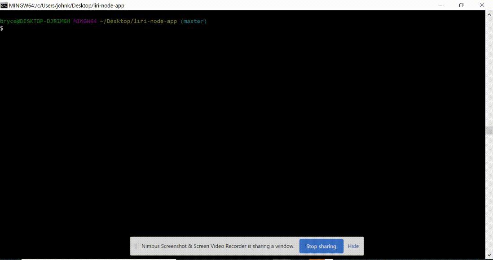
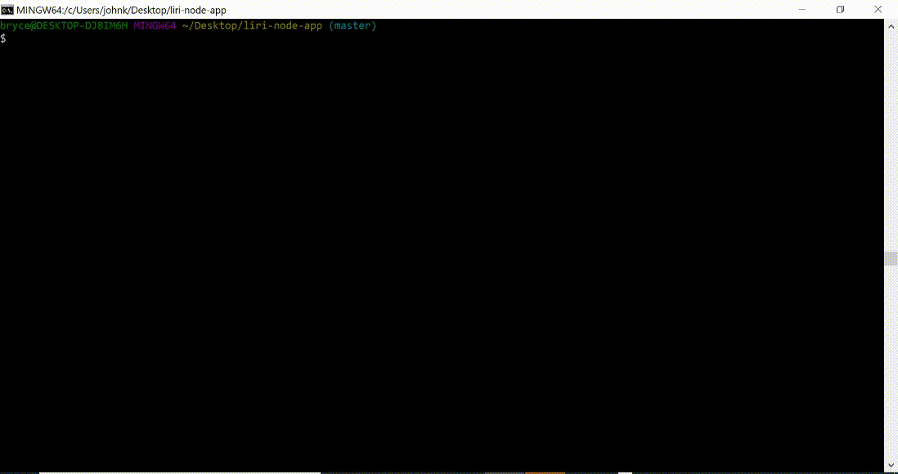
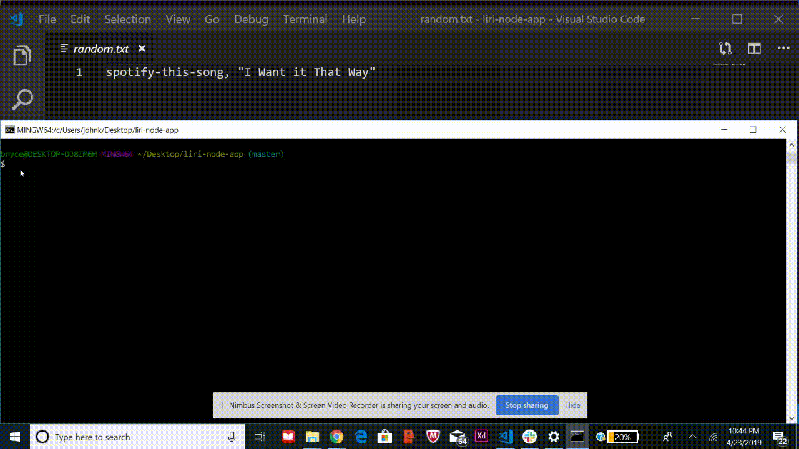

# Liri-Node-App

### **What is LIRI?**

LIRI is like iPhone's SIRI. However, while SIRI is a Speech Interpretation and Recognition Interface, LIRI is a Language Interpretation and Recognition Interface. LIRI will be a command line node app that takes in parameters and gives you back data.

## Getting Started

### **Requirements**

* node.js
* git bash (*or some other terminal capable of running node applications*)
* text editor (*for adding API keys in .env file*)

### **Installation**

1. Clone the repository:

    `git clone https://github.com/Bryceacampbell/liri-node-app.git`

2.  Open application in directory and install the dependencies:

    `npm install`

3. Create a file named .env and insert **your** API keys like below:

    ```SPOTIFY_ID=<YOUR-SPOTIFY-ID>  
    SPOTIFY_SECRET=<YOUR-SPOTIFY-SECRET>  
    OMBD_API_KEY=<YOUR-OMDB-API-KEY>  
    BINT_API_KEY=<YOUR-BANDS-IN-TOWN-API-KEY>
    ```

## Running The Application

>NOTE | *Confirm you are in the correct directory prior to running these commands*
    
### **Set up**

`node liri.js` `<command>` `<string>`

### **Commands**

1. spotify-this-song `string`

The `spotify-this-song` command utilizes the **Spotify-API** and allows a user to search a song title. This command will take in a `string` and return the names of every **artist** with the entered **song title** as well as a **preview url** and the **album** each song is on.

___

2. movie-this `string`

The `movie-this` command uses the **OMDB-API** and takes in a user input to search a movie title. This command will take in a `string` and will return :

* The movie title
* Released date
* IMBD Rating
* Rotten Tomatoes Rating
* Country it was filmed in
* Languages available
* The plot of the movie
* The actors in the movie

___

3. concert-this `string`

The `concert-this` command uses the **Bands In Town API** and takes in a user input to search a specific music artist. This command will take in a `string` and return concert data such as :

* Venue
* Venue Location
* Concert Date

___

4. do-what-it-says

The `do-what-it-says` command will read the **random.txt** file and perform the previously set command. This command does not take in any additional arguments.

___

### **Examples**

>NOTE | *a `string` can include spaces in any of the following commands*

`node liri.js spotify-this-song native blood`


`node liri.js movie-this avengers`



`node liri.js concert-this silent planet`



`node do-what-it-says`




